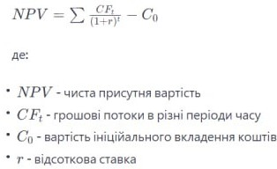

<!DOCTYPE html>
<html lang="ua">
<head>
<meta charset="UTF-8">
<title>Відсоткові калькулятор</title>

</head>
<body>
<h1>Актуальність відсоткового калькулятору</h1>

Економічна теорія з використанням відсотків визначає основні засади функціонування фінансово-економічних систем та їх взаємодію з різними суб'єктами. Відсоткові ставки виступають ключовим елементом цієї теорії, оскільки вони впливають на різні аспекти економіки, включаючи інвестиції, споживчі витрати, рівень кредитування та інші.

   

<h1>Чому потрібні відсоткові калькулятори в економіці</h1>

Відсоткові калькулятори в економіці є важливим інструментом для розрахунків і визначення різних фінансових параметрів.

<h1>Відсотки в економіці</h1>

Ось декілька сфер, де вони використовуються:

Розрахунок відсотків: відсоткові калькулятори дозволяють легко визначити обсяг відсотків від певної суми грошей. Наприклад, вони можуть бути використані для розрахунку відсотків на кредит, депозит чи інші фінансові інструменти.

Кредитні операції: при оцінці вартості кредиту важливо враховувати не лише процентну ставку, але і період позички та кількість платежів. Відсоткові калькулятори допомагають визначити суму щомісячних чи річних платежів і загальний обсяг виплат.

Дисконтні розрахунки: в бізнесі відсоткові калькулятори використовуються для розрахунку дисконтованих потоків грошей. Це дозволяє визначити сучасну вартість майбутніх грошових потоків та оцінити проект чи інвестицію.

Депозитні операції: якщо ви маєте гроші на депозиті, ви можете використовувати відсотковий калькулятор для розрахунку очікуваних виплат за вкладом в залежності від різних умов та відсоткових ставок.

  
Розрахунок прибутку та збитків: відсоткові калькулятори також можуть бути використані для оцінки прибутку чи збитків від фінансових операцій чи інвестицій.

  
Облік відсотків по кредиту: коли ви виплачуєте кредит, частина суми йде на сплату відсотків, а решта - на сплату основної суми кредиту. Відсоткові калькулятори допомагають розрахувати, яка частина платежу призначена на відсотки, а яка - на основну суму кредиту.

  
Використання відсоткових калькуляторів спрощує фінансові розрахунки, допомагає у прийнятті раціональних рішень та визначенні фінансової ефективності різних операцій чи інвестицій.

    

<h1>Концепцій економічної теорії</h1>

Однією з фундаментальних концепцій економічної теорії є часова цінність грошей. Вона визначає, що гроші, одержані чи витрачені сьогодні, мають іншу вартість, ніж ті самі гроші в майбутньому. Ця ідея є в основі розуміння ролі відсотків у економіці.

Формула для розрахунку майбутньої вартості (FV) грошей включає в себе відсоткову ставку (r) та період часу (t):

  

  
Ця формула дозволяє оцінити, як змінюється вартість грошей з плином часу під впливом відсоткової ставки.

  
Іншим ключовим аспектом є вартість грошей в часі. Відомий як дисконтована вартість (Present Value, PV), цей підхід використовується для розрахунку поточної вартості майбутніх грошей. Формула для розрахунку дисконтованої вартості:

 

  
Використовуючи ці концепції, економічна теорія вивчає вплив відсотків на інвестиції, споживчі витрати та рівень кредитування. Наприклад, підвищення відсоткових ставок може призвести до зменшення витрат на споживчі товари та послуги, оскільки кредит стає дорожчим. З іншого боку, зниження відсоткових ставок може стимулювати інвестиції та споживання.

  
Також, відсоткові ставки грають ключову роль у розрахунках чистої присутної вартості (Net Present Value, NPV) при оцінці проектів та інвестицій. Формула NPV включає в себе дисконтовану вартість майбутніх грошових потоків.

  
У підсумку, використання відсоткових ставок у формулах економічної теорії дозволяє аналізувати та прогнозувати економічні явища, визначати різні фінансові показники та приймати обґрунтовані рішення щодо інвестицій, кредитування та інших аспектів фінансово-економічної діяльності.

  <h1>Посилання</h1>

Переходьте на сайт відсоткового калькулятору:
    <a href=http://www.example.com>Example</a> 
   <a href=https://sofiayehorova.github.io/Percentage_Calculator/>Переходьте на сайт відсоткового калькулятору</a>

</body>
</html>
